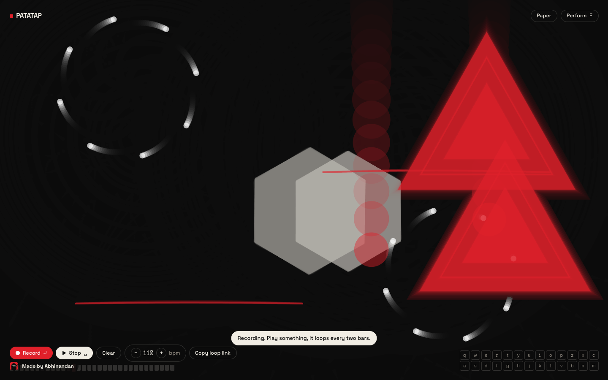
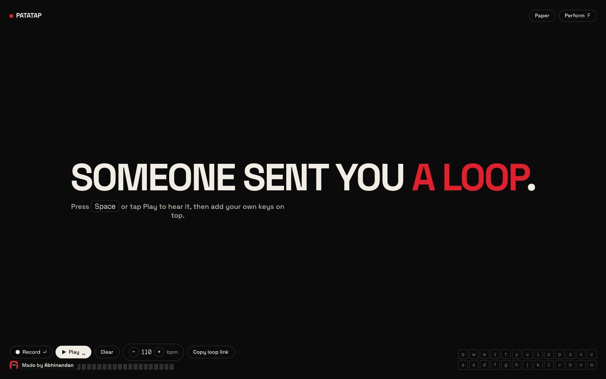

# Patatap

Press a key, get a sound and a shape. Every letter from A to Z plays a synthesised hit and draws a motif on a full-screen canvas: ripples, shards, springs, blooms, beams. Record a two-bar loop, share it as a link, play it from a MIDI controller or by tapping a phone.

**Play it:** https://abhinandansharma.github.io/patatap/





A study of [Patatap](https://patatap.com) by Jono Brandel. The 2020 version used Paper.js and a folder of MP3s. This one ships no audio files at all.

## How it works

- **Sound.** All twenty-six hits come from [Ambiently](https://github.com/abhinandansharma/ambiently)'s `createHits()`: kicks, snares, hats, claps, toms, plucks, bells, chimes, stabs, zaps, lasers, sweeps and risers built from oscillators, filters and noise on the Web Audio clock. Left hand is drums, right hand is melody; the bottom row transposes.
- **Shapes.** A 2D canvas renderer. Each hit spawns a shape whose lifetime matches the sound's length, eased or sprung, with a slow frame fade so motion leaves trails. Twenty motifs.
- **Loop.** `Enter` starts recording a two-bar, sixteenth-note loop at the current tempo; presses are quantised as you play and loop immediately. `Space` plays or stops, `Backspace` clears, arrow keys change the tempo. "Copy loop link" puts the loop in the URL (`#loop=110-a.s..d`), and anyone who opens it can play and add to it.
- **Input.** Keyboard, multi-touch (the screen is a 13 by 2 grid of pads), and Web MIDI (any note-on maps onto the letters).
- **Modes.** Ink and paper themes, and a performance mode that hides the interface (`Shift+F`, `Escape` to return).

## Run it

```bash
npm install
npm run dev        # http://localhost:5173/patatap/
npm run build      # static site in dist/
```

Set `AMBIENTLY_LOCAL=1` to import Ambiently from a sibling checkout instead of npm while working on both.

## Stack

Vite, TypeScript, Web Audio, Canvas 2D, Web MIDI. Space Grotesk for text and [Geist Pixel](https://vercel.com/font) (Square) for the numerals, self-hosted. Deployed to GitHub Pages by the workflow in `.github/workflows/pages.yml`.

Built by [Abhinandan Sharma](https://abhinandansharma.github.io/portfolio/).
